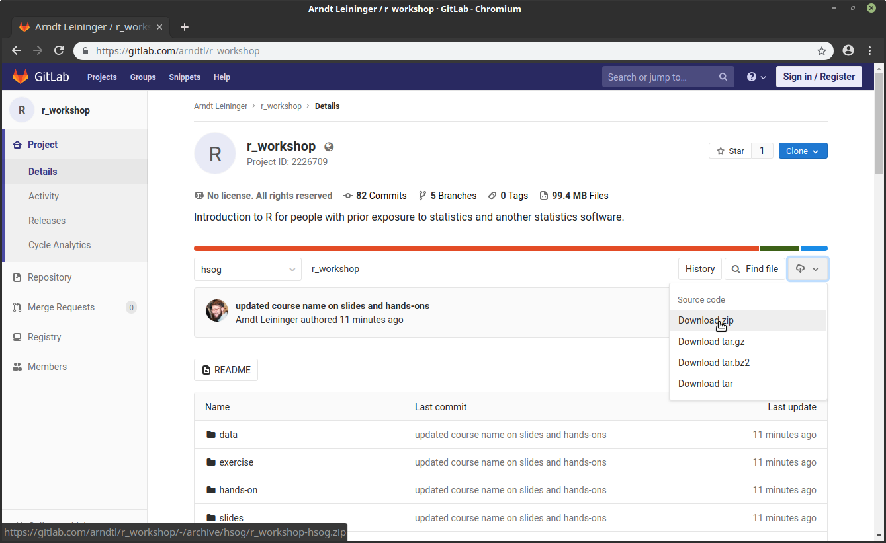
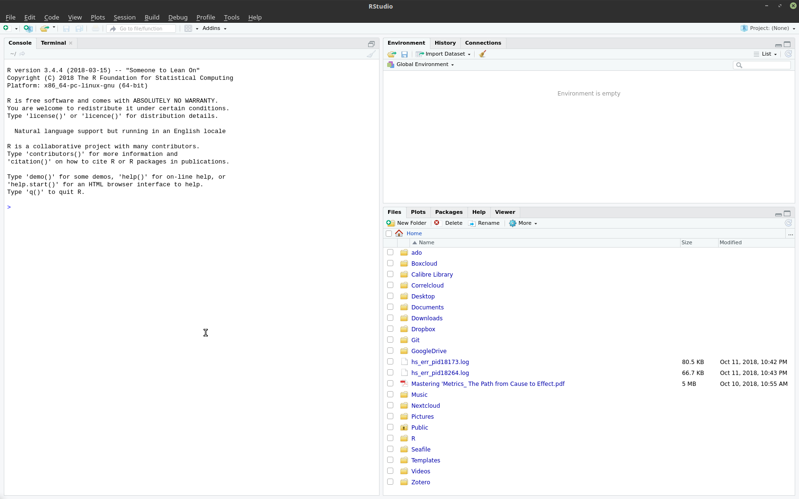
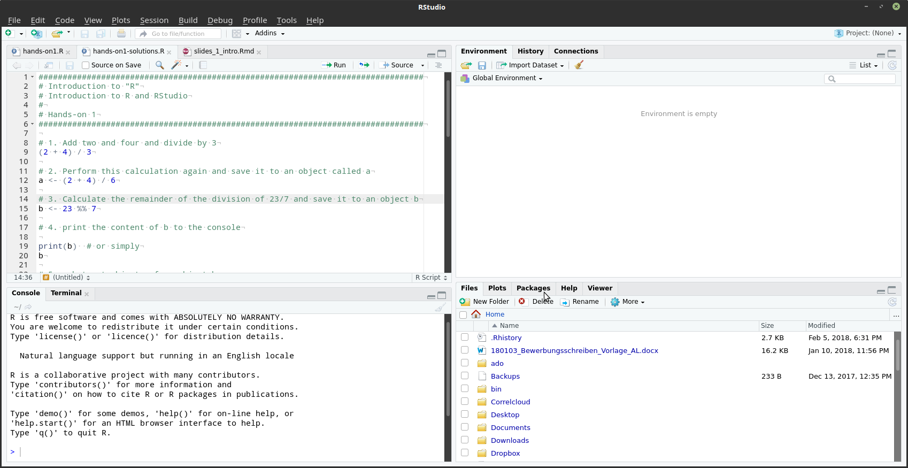
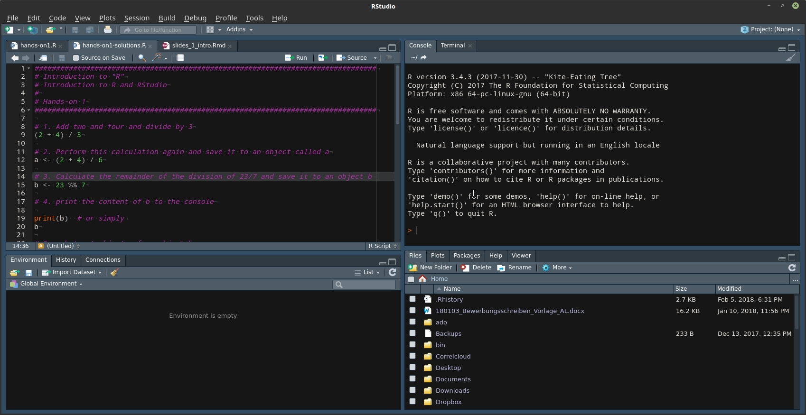
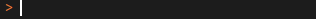

```{r setup, include=FALSE}
#options(width=50)
knitr::opts_chunk$set(echo = TRUE, eval = FALSE, cache = TRUE, collapse = TRUE)
```

# About the course

## Program

**Saturday, 28 September 2019**

10:00h - 11:30h Introduction to R and Rstudio

*11:30h - 11:45h break*

11:45h - 13:00h Introduction to R and RStudio (cont.)

*13:00h - 14:00h Lunch break*

14:00h - 15:30h Data Manipulation

*15:30h - 15:45h break*

15:45h – 16:30h Data Wrangling

## Program

**Sunday, 29 September 2019**

10:00h - 11:15h Recap and Model Estimation

*11:15h - 11:30h break*

11:30h - 13:00h Data Visualization

*13:00h - 14:00h Lunch break*

14:00h - 16:30h Data and Model Visualization

## Managing Expectations

- R is a (programming) language. 
- Just as you cannot learn Latin in 1 1/2 days, you will not be fluent in R after this workshop. 

\begin{figure}
\includegraphics[width=.5\textwidth]{img/LearningCurve2.png}
\caption{R Learning Curve, https://sites.google.com/a/nyu.edu/statistical-software-guide/summary}
\end{figure}

- More on [Why R is Hard to Learn](http://r4stats.com/articles/why-r-is-hard-to-learn/)

## Course materials



## Course materials

- Slides, exercises and solutions here
    - https://gitlab.com/arndtl/r_workshop
- Download the zip file
    - or clone the repository if you use Git
- Extract the zip file
- rename the folder to r_workshop if necessary

# About R

## R

- \textsf{R} is an Open Source environment for statistical computing and graphics available for all common OS: Windows, Mac OS X as well as Linux
- \textsf{R} is being actively developed with two major releases per year and hundreds of releases of add on packages
- \textsf{R} can be extended with 'packages' to add new functionality
- \textsf{R} is an object oriented programming language. Everything in Object-Oriented Programming (OOP) is grouped as self sustainable "objects"

## Why \textsf{R}

**Because**

- Both \textsf{R} and RStudio are open-source and free
- \textsf{R} is a language. Data analysis is done by writing functions and scripts, not by pointing and clicking facilitating reproducible research
- 14932 available packages (as of 20 September 2019)
    - 13314 available packages (as of 1 November 2018)
    - 9293 available packages (as of 5 October 2016) 
    - There's a canned solution for almost anything
- A robust and growing community of thousands of contributors and more than two million users around the world
- It works with data from Stata, SPSS, SAS and other statistical software
- Work with multiple datasets at the same time
- Beautiful graphics

# Introducing RStudio

## Interacting with R

- We'll use R through the RStudio GUI
- The RStudio GUI has 4 panes:
    - *Source*
    - *Console*
    - Two flexible panes, defaults are...
        - Environment, History
        - Files, Plots, Packages, Help, Viewer

## RStudio GUI


        
## RStudio GUI



## RStudio GUI

Options $\rightarrow$ Pane Layout

Option $\rightarrow$ Appearance



# First steps in R

## Coding in R



- Mathematical expressions will be evaluated

Examples

```{r, rexample, eval = T, error=T}
1 + 2
2^2
9/3
# R calculates the result and prints it to console
```

## Coding in R

- Character input: R will check for functions and objects in its memory that match the input

```{r, rexample2, eval = T, error=T}
randomtext
# returns an error since there is no such object
```

If there is no assignment to an oject output will be printed to the console.

## The assignment operator 

- Introducing R's assignment operator `<-`, `=` also works but is frowned upon
    - Inversely, `->` also works
- The shortcut \keys{\Alt + -} produces the assignment operator

```{r assignmentoperator, eval=TRUE}
1 + 3 # calculates the result and prints it to the console

sum <- 1 + 3  # calculates the result and saves it to 
# object 'sum' nothing is printed on the console

sum  # prints 4 on the console
# when you run an object name it is fed to the print() 
# function by default

```

## The assignment operator 

- There is NO warning that assignment will overwrite prior content
- Objects can take on any type; a numeric object `a` can easily be turned into a character object `a`

```{r, eval=TRUE}
sum
sum <- '1 + 3'  # "1 + 3" also works
sum

```

## Quick hands-on

1. Save the text `"Hello World"` to an object called `obj`.
2. Austria became a member of the European Union in 1995. Calculate how many years it's been since then. 
3. Save the result of that calculation to `obj`.

## *`<-` vs. `=`*

- the origins of the `<-` symbol come from old APL keyboards that actually had a single `<-` key on them
- however, there are subtle differences between `<-` and `=`

```{r assignment_operator, eval=TRUE, error=TRUE}
x <- y <- 5
x = y = 5
x = y <- 5
x
y
x <- y = 5

median(a <- 1:10)
median(a = 1:10)
```

## *`<-` vs. `< -`*

```{r}
x<-3
x
x < -3
```

http://stat.ethz.ch/R-manual/R-patched/library/base/html/assignOps.html

## Objects vs. text

```{r, eval=TRUE, error=TRUE}
hello
'hello'
hello <- 'hello'
hello
hello <- 'Hello'
hello
```


## Understanding functions

- R functions are what in other programs are called commands, i.e. Stata. They take information we give to them, do something with the information, then output something. 
- We pass information to functions with arguments. 

```{r, eval=TRUE}
print(x = 'Hello World!') 
# x is the name of argument which is supplied with 
# the character vector 'Hello Wien' which is then 
# printed to the console

print('Hello World!')  
# you can omit argumnt names and R will use the order 
# of arguments to identify them
```

- The function `print()` is also called when you just enter the name of an object or text ike `"Hello World!"`

## Functions vs. Objects

```{r, functionvsobject, eval=TRUE, error=TRUE}
print <- 'Hello World!'  # this is an object
print()  # this is a function
print(print)  # prints the object 'print'
```

Functions alway have brackets even if there're no arguments.

```{r, eval=TRUE}
Sys.Date()
```

## Understanding functions

```{r func_ex1, eval=TRUE}
# creates a vector of 100 random draws from a normal 
# distribution with mean 1 and standard deviation 2
rnorm(n = 100, mean = 1, sd = 2)  

```

## Understanding functions

```{r func_ex2, eval=TRUE}
rnorm(100, 1, 2)  # does the same

```

## Understanding functions

```{r}
rnorm(1, 2, 100)  # does this do the same?
```

## Understanding functions

```{r func_ex3, eval=TRUE}
rnorm(1, 2, 100)  # does this do the same?

d <- rnorm(100, 1, 2)  # the output of the function can of 
# course be assigned to an object

d  # prints the object to the console

```

## Getting help

- When writing function calls hit \keys{\tab} for autocomplete of function names, argument names and arguments
- Type `help()` and the name of the function within the brackets. 
    - For example, `help(lm)` will take you to the `lm()` functions’s manual
    - `?lm` is shorter and does the same
    
## *Reading a help file*

1. *Description* what the command does
2. *Usage* Shows a call to the function with all arguments set to their default.
3. *Details* and *Values* Explanation of further particulars
4. *Examples* Code snippets

- You don’t always need to set a lot of arguments but you should pay
attention to what the defaults are.
- If you don’t know the function you want to use, you will have try and describe your problem to a search engine of your choice.

## Writing good code

Good code should be readable by humans as well as computers.

- Use comments to explain what each line is doing (#)
    - This can be annoying in the work process but it's even more annoying to try to understand uncommented code
- Empty lines and spaces make your code easier to read
- Use meaningful names when you create them, and write them consistently (`variablename`, `variableName` or `variable_name`, ...)
- Follow indentation conventions e.g.

```{r indentation, eval=TRUE}
c('Concatenate two rather length texts',
  'so that they form a vector of lenght 2')
```

## Comments

- Commenting code is important. It enables others to understand your code (that includes your future self!)
- There is only one comment sign in R: `#`
- Everything on a line following the `#` is a comment
- For a multiline comment every line needs to start with a `#`
- The keyboard shortcut in RStudio for commenting out one or multiple lines is \keys{\ctrl + \shift + C}
    - Use the same shortcut on a comment to 'uncomment'

## Comments

- An example from `hands-on/01_intro/hands-on1.R`

```{r comments, eval=TRUE}
# Introduction to "R"
# Introduction to R and RStudio
#
# Hands-on 1

# 1. Add two and four and divide by 3
(2 + 4) / 3 # adds 2 and 4 together and then divides by 3
```


# More on RStudio

## Running code

... from the source editor 

- \keys{\ctrl + \return} runs the code on a single line
    - Set "Ctrl + Enter" to "Current line" in Options $\rightarrow$ Code: If a function is not finished on a line R will wait for further input
    - You can run subparts of a line or multiple lines by highlighting the code you want to execute and then pressing \keys{\ctrl + \return}
    
... from the console

- Hit \keys{\return} to run a line of code

Use \keys{\ctrl + 1} and \keys{\ctrl + 2} to swith between editor and console.

## *Useful things about the Source Editor*

- Line numbering
- Syntax highlighting
- You can set a highlighting scheme and other options for how code is displayed
- Autocomplete for object names and functions
	- Type the first few characters of an object name, hit \keys{\tab}, RStudio will suggest what to write
	- Hit \keys{\tab} within a function and you'll get a dropdown of all arguments of the function incl. a brief explanation
	- Hit \keys{\tab} after the equal sign following an argument and you'll get suggestions for inputs to the argument
- Any code is copied from the script to the console and then executed

## *Useful things about the console*

- Almost all of these features can be used in the console
- You can toggle through prior executed functions by
	- \keys{\arrowkeyup} and \keys{\arrowkeydown}
	- \keys{\ctrl + \arrowkeyup} and then \keys{\arrowkeyup} and \keys{\arrowkeydown} to toggle
- Clear screen: \keys{\ctrl + L}

## *Keyboard shortcuts thus far*

- Assignment operator: \keys{\Alt + -}
- Autocomplete: \keys{\tab}
- Comment and uncomment: \keys{\ctrl + \shift + C}
- Run code in script: \keys{\ctrl + \return}
- Run code in console: \keys{\return}
- Toogle through executed code: \keys{\arrowkeyup} and \keys{\arrowkeydown}
- Clear screen: \keys{\ctrl + L}
- Switch to source: \keys{\ctrl + 1} 
- Switch to console: \keys{\ctrl + 2}
- Keyboard Shortcut Help: \keys{\shift + \Alt + K}

## *Some mathematical expressions in R*

```{r math}
2 + 2  # Addition

3 - 2  # Substraction

2 * 2 # Multiplication

10 / 3  # Division

a %*% b # Matrix multiplication

```

https://stat.ethz.ch/R-manual/R-devel/library/grDevices/html/plotmath.html

# Hands-on 1

## Hands-on 1

`hands-on/01_intro/hands-on1.R`

# Working with data

## Opening a file

- Reading a file is done through a function, here we'll use `read.csv()`
- This function is for reading comma-separated vector files, short CSV
- Here's an example
```
V1, V2, V3, V4
1, 0, 2, male
2, 2, 1, female
```

- Using `?read.csv` we learn that the function takes a file path as input
    - All other arguments have defaults and do not need to be specified

## File paths

- File paths tell the computer where to read and write information.
- Separators between folder names differ between Windows (`\`) and Mac/Linux (`/`). 
- However, in R, independent of the OS used, forward slashes (`/`) are used exclusively.

## Absolute and relative file paths on Windows

```
C:
+- Users
   +- Bill
   |  +- Dropbox
   |     +- coolproject
   |        + code
   |        + data   
   |          +- master.csv
   +- Melinda
```

- Absolute path to project folder: `C:/Users/Bill/Dropbox/coolproject`
- Relativ path to file `master.csv`: `data/master.csv`

## Absolute and relative file paths on Mac OS

```
/
+- Users
   +- Steve
   |  +- Dropbox
   |     +- coolproject
   |        + code
   |        + data
   |          +- master.csv
   +- Laurene
```

- Absolute path to folder `coolproject`: `/Users/Steve/project_w_bill_and_linus`
- Relative path to file `master.csv`: `data/master.csv`

## Absolute and relative file paths on Linux

```
/
+- home
   +- linus
   |  +- Dropbox
   |     +- coolproject
   |        + code
   |        + data
   |          +- master.csv
   +- tove
```

- Absolute path to project folder: `/home/linus/coolproject`
- Relative path to file script.R: `data/master.csv`

## Absolute vs. relative paths

- Ideally use an absolute path only for setting the working directory
- Everything else should be relative paths
- Absolute paths cause errors when you give a project folder to a coauthor/collaborator

```{r}
setwd('C:/Users/Bill/project_w_steve_and_linus') # code for Bill
setwd('/Users/Steve/project_w_bill_and_linus') # code for Steve
setwd('/home/linus/project_w_bill_and_steve') # code for Linus

df <- read.csv('data/master.csv') # same relative path for everyone
```


## *Directory structure*

- *Absolute paths* start from the top of the tree and specify each
subdirectory until the file e.g. `C:\Users\Bill\document.docx` (or
`/home/linus/document.tex`, or even `https://gitlab.com/arndtl/r_workshop`)
- However in R the paths are `C:/Users/Bill/document.docx` and `/home/linus/document.tex`
- *Relative paths* start from the current working directory; use `../` to move to the directory above the current one
- R starts with your home directory as working directory. 
- Say you have your Stats II stuff in `C:\User\JDoe\Dropbox\stats2` then to set this folder as working directory you use `setwd('C:/User/JDoe/Dropbox/Hertie/stats2')`

## *Converting \\ to /*

```{r converting_slashes}
gsub("\\\\",  "/",  readClipboard())
```

## Opening a dataset

```
/
+- home
   +- arndt
      +- Git
         +- r_workshop
            +- data
               +- BundestagForecastReplicationData.csv
```

```{r}
# 1. Set your working directory 
setwd('/home/arndt/Git/r_workshop/')
```

```{r read_csv}
# 2. open the file
# what happens if you run this line of code?
read.csv('data/BundestagForecastReplicationData.csv')  
```

Data from Kayser, Mark A. and Arndt Leininger (2016) "A Predictive Test of Voters' Economic Benchmarking: The 2013 German Bundestag Election", *German Politics*, 25(1), pp. 106-130

## Opening a dataset

```{r read_csv2}
# 2. open the file
# this happens
read.csv('data/BundestagForecastReplicationData.csv',
               stringsAsFactors = F)  
```
```{r read_csv2_hidden, echo=FALSE, eval=TRUE}
# 2. open the file
# this happens
read.csv('../data/BundestagForecastReplicationData.csv',
               stringsAsFactors = F)  
```


## Opening a dataset

```{r read_csv3_hidden, eval=TRUE, echo=FALSE}
# 2. open the file and assign its content to an object
df <- read.csv('../data/BundestagForecastReplicationData.csv',
               stringsAsFactors = F)
```

```{r read_csv3}
# 2. open the file and assign its content to an object
df <- read.csv('data/BundestagForecastReplicationData.csv',
               stringsAsFactors = F)
```

- The argument `stringsAsFactors = F` will be explained in a bit

## `getwd()`

If you're unsure what your working directory is set to:

```{r}
getwd()
```

```{r, eval=TRUE, echo=FALSE}
setwd('~/Git/r_workshop')
getwd()
```


## Quick hands-on

1. Set the working directory to the r_workshop folder using (`setwd()`).
2. Read the file `BundestagForecastReplicationData.csv` contained in the subfolder `data`. Assign the output of `read.csv()` to an object called `df`.

## Data in R

- Data sets in R are most often saved as objects of type `data.frame`. 
- A `data.frame` ist just another object and so you can have multiple objects of type `data.frame` in your memory at the same time.

```{r}
df2 <- df
```

- An understanding that a data.frame is a matrix is an important basis for competent usage of R.
- As usual: columns are variables and rows are observations. 

## A first glance at the data

```{r datasum, eval=TRUE}
dim(df)  # returns row and column count
nrow(df)  # returns the number of rows
ncol(df) # returns the number of cols
summary(df)
```

## Variables

- Variables in a data.frame can be accessed via a simple method in R

```{r variables, eval=TRUE}
# Our data.frame contains many variables
# To get a list of the variable names and the variable names only:
names(df)

# Say we're interested in the variable 'outgovshare'
df$outgovshare
```

## Finding out about the type of a variable

- `class()` returns the type of a variable or in fact any object in R

```{r, eval=TRUE}
class(df$wp)
class(df$outgovcoa)
class(df)
```

## Quick quiz

Which of the code snippets are complete statements that R will run without error? What's wrong with the others?

1. `print("Hello World!')`
2. `B <- 2/3`
3. setwd('C:\\Users\\Arndt\\Documents')
4. `getwd`
5. `rnorm(n = 10, mean = 0, sd = 2 # sd is short for standard deviation)`

## Interlude: the concatenate function `c()`

- `c()` is short for concatenate
- It assembles multiple individual values into a vector
- E.g.

```{r concatenate, eval=TRUE}
c(1, 2, 4, 5)

c(1, 2, TRUE, "Hallo")
```

- If different types of values are pased on to `c()` the function will force them to be of type character

## Variables

There are basically four types of variables in R.

1. Numeric
2. Character
3. Factor
4. Logical

(Yes, there's also a `datetime` type.)

## Numeric vector

- A numeric vector contains numbers
- With `as.numeric()` you can turn numbers saved as characters into numbers

```{r, eval=TRUE, error=TRUE}
'3' / 3

as.numeric('3') / 3
```


## Character vector

- Character vectors contain text just as string variables in Stata
- With `as.character()` you can turn objects into character objects
- Both " and ' can be used

```{r character, error=TRUE, eval=TRUE}
# Example
four <- '4'

four
four * 4
as.numeric(four) * 4
```

## Factor variables

- Factors are used to save categorical (nominal or ordinal) variables
- With `as.factor()` you can turn objects into factor objects
- By default, when reading datasets with `read.csv()`, R will turn character variables into factors unless you set `stringsAsFactors = FALSE`

```{r factor, eval=TRUE}
fac <- factor(c("Democrat", "Republican", "Independent"))
fac

```

## Factor variables

- Ordered factors can be created by setting the argument `ordered=T`

```{r factor2, eval=TRUE}
data_analysis_software <- c('Excel', 'SPSS', 'Stata', 'R')
data_analysis_software <- 
  factor(data_analysis_software,
         levels = data_analysis_software, ordered = T)
data_analysis_software  
# ;-)
```

## Logical

- Logical is a boolean factor that takes on the values `TRUE` (also abbreviated as `T`) and `FALSE` (`F`)
- Logical vectors can be used in mathematical operations: `TRUE` is treated as `1` and `FALSE` as `0`

```{r boolen, eval=TRUE}
truefalse <- c(TRUE, FALSE, T, F)
truefalse

example <- 2 > 1
example
```

## Quick hands-on

1. Create a vector called `boolean` which contains two elements, the values `TRUE` and `FALSE`, by using the concatenate function `c()`
2. Create a vector called `number` containing the values `2` and `3`
3. Multiply the vectors `boolean` and `number`
4. Save the result in a vector called `result`
5. Print the vector `result` to the console
6. Check the type of the vector `result` using `class()`
6. Turn vector `result` into a vector of type `character`

## Creating a new variable

- Creating a new variable is done by assigning a value to a previously undefined variable

```{r, eval=TRUE}
df$newvar <- df$outgovshare / 100
# express vote share in fration instead of percentages
df$newvar
```

## Replacing the content of a variable

```{r}
df$outgovshare <- df$newvar
# the content of the variable is replaced without any warning!
```

## Deleting a variable

```{r, eval=TRUE, tidy=TRUE, tidy.opts=list(width.cutoff=40)}
ncol(df)
df$newvar <- NULL
ncol(df)
```


## Deleting an object

```{r, eval=TRUE}
# but
a  <- NULL
a
rm(a)  # deletes object a from R's memory
```

- NULL is the logical representation of a statement that is neither TRUE nor FALSE
- https://www.r-bloggers.com/r-na-vs-null/


## Calculating the mean

```{r, eval=TRUE}
mean(df$outgovshare)
```

## Missing values

```{r, eval=TRUE}
df$outgovshare
```

- Missing values in R are denoted by `NA`
- `NA` can appear in numeric, factor and character variables
- `NA`s are not automatically disregarded by all functions

## Calculating the mean

```{r, eval=TRUE}
mean(df$outgovshare, na.rm = T)
```

## Demeaning a variable

```{r, eval=TRUE}
df$demeaned <- df$outgovshare - mean(df$outgovshare, 
                                     na.rm = T)
```

## Saving data

- `write.csv()` writes a `data.frame` object to a CSV-file
- It takes an object and file path as input
- Hint: set `row.names = F` otherwise R will write a first column of row names (most of the times simply a running count of the lines) into the file. The first row of this first column will be empty which can cause problems with other programs when trying to open the file

```{r getwd}
getwd()
```
```{r getwd_hidden, echo=FALSE, eval=TRUE}
'/home/arndt/Git/r_workshop/'
```


```{r savefile}
write.csv(df, 'data/newdata.csv', row.names = F)
```

## `row.names = T`

```{r savefile3}
write.csv(df, 'data/newdata.csv', row.names = F)
write.csv(df, 'data/newdata.csv')
```

```{r savefile3_hidden, echo=FALSE, eval=TRUE}
write.csv(df, '../data/newdata.csv', row.names = F)
```

Resulting file:

```
"X","wp","year","date","outgovcoa", ...
"1", 1,1,1949,"14.08.1949","","15.09.1949","", ...
"2", 2,2,1953,"06.09.1953","CDU/CSU, FDP and DP", ...
"3", 4,4,1961,"17.09.1961","CDU/CSU","15.09.1949", ...
...
```

## `row.names = F`

```{r savefile2}
write.csv(df, 'data/newdata.csv', row.names = F)
```

```{r savefile2_hidden, echo=FALSE, eval=TRUE}
write.csv(df, '../data/newdata.csv', row.names = F)
```

Resulting file:

```
"X","wp","year","date","outgovcoa", ...
1,1,1949,"14.08.1949","","15.09.1949","", ...
2,2,1953,"06.09.1953","CDU/CSU, FDP and DP", ...
4,4,1961,"17.09.1961","CDU/CSU","15.09.1949", ...
...
```


# Hands-on 2

## Hands-on 2

`hands-on/01_intro/hands-on2.R`

# Appendix

## *Some commonly used functions in R*

http://www.statmethods.net/management/functions.html

## *Keyboard shortcuts*

- \keys{\tab} for autocomplete
- \keys{\Alt + -} produces the assignment operator `<-`
- \keys{\ctrl + \shift + C} for comments, toggle on/off
- \keys{\ctrl + \return} runs from the script
- \keys{\arrowkeyup} and \keys{\arrowkeydown}
- In console \keys{\ctrl + \arrowkeyup} as well as \keys{\arrowkeyup} and \keys{\arrowkeydown} to toggle input
- Switch to source: \keys{\ctrl + 1} 
- Switch to console: \keys{\ctrl + 2}
- \keys{\ctrl + L} produces a clear screen

## *Cheat sheets*

[Base R](http://github.com/rstudio/cheatsheets/raw/master/base-r.pdf)

[RStudio IDE](https://github.com/rstudio/cheatsheets/raw/master/rstudio-ide.pdf)

[Data Visualization with ggplot2](https://github.com/rstudio/cheatsheets/raw/master/data-visualization-2.1.pdf)

[Data Transformation with dplyr](https://github.com/rstudio/cheatsheets/blob/master/data-transformation.pdf)


[Colors in R](http://www.stat.columbia.edu/~tzheng/files/Rcolor.pdf)

[R Reference Card](ftp://cran.r-project.org/pub/R/doc/contrib/Short-refcard.pdf)

[Built-in Functions ](http://www.statmethods.net/management/functions.html)

[Model formulas in R](https://ww2.coastal.edu/kingw/statistics/R-tutorials/formulae.html)

Some cheat sheets can also be found through RStudio: Help > Cheatsheets.

Find more at [rstudio.com/resources/cheatsheets/](https://www.rstudio.com/resources/cheatsheets/)