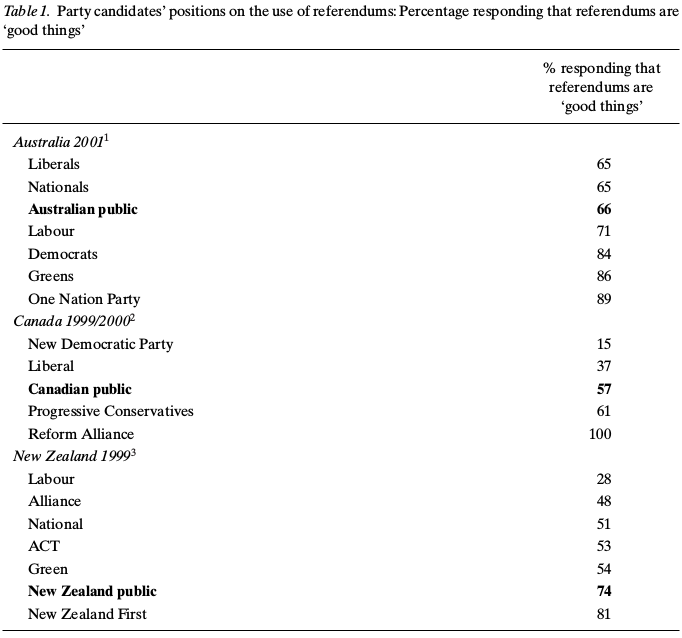

```{r setup, include=FALSE}
# setwd('~/Git/r_workshop/slides')
options(width=55)
knitr::opts_chunk$set(echo = TRUE, eval = FALSE, cache = TRUE, 
                      warning = FALSE, message = FALSE,
                      tidy=TRUE, tidy.opts=list(width.cutoff=55),
                      dev = 'png',
                      fig.width=12, fig.height=7)
library(magrittr)
library(ggplot2)
library(ggthemes)
library(dplyr)

theme_set(theme_gray(base_size = 20))
```

# Data visualization I

## Plotting in R

R has exceptional graphing facitilies. There is the base `plot` package and 
additional packages such as `lattice` and `ggplot2`. We will use `ggplot2` 
because it is easy and intuitive to use.

```{r, eval=TRUE}
library(ggplot2)
```

## A first glimpse at `ggplot2`

- We'll use the dataset `diamonds` included in `ggplot2`
- Here's a scatter plot of the price of diamonds against carat.

```{r ggplot, eval=TRUE, out.height='.4\\textwidth', fig.align='center', cache=TRUE}

data(diamonds)
# a standard scatter plot
ggplot(diamonds, aes(x = carat, y = price)) + geom_point()
```

## The grammar of graphics

A plot consists of

1. `data`
2. `mappings` describing how variables in the data are mapped to aesthetic attributes
3. `geoms` geometric objects
4. `stats` statistical transformations
5. `scales` map values in data to values in aesthetic space
6. `coord` coordinate system, most of the cases cartesian
7. `facet` facetting breaks up plot in several group-specific subplots

## ggplot2

```{r ggplot2}
ggplot(diamonds, aes(x = carat, y = price)) + geom_point()
```

- `ggplot()` is the main function and takes the `data` and a `mapping` (`aes()`) as arguments
    - `aes()` sets the aesthetics, `x` and `y` variables but also other variables depending on the plot

- `+` adds a new layer on top of the plot

- `geom_point()` is a geometric object, it draws dots at the x-y-coordinates
- there are no statistical transformations
- `scales` are given on the axis
- `coord` is cartesian
- no facetting

## Data

```{r ggplot3}
ggplot(diamonds, aes(x = carat, y = price)) + geom_point()
```

- `data` is the first argument in `ggplot()`
- the input needs to be a `data.frame`
- `geom_...()` can also take a `data.frame` as second argument


## Mapping

- `aes()` knows the following arguments:
    - `x` and `y` (also `xmin`, `xmax`, `xend`, `ymin`, `ymax`, `yend`)
    - `group` seperates the data into groups for separate geoms
    - `fill` for filling geometric objects with color
    - `color` for coloring dots and outlines of other objects
    - `shape` to determine the shape of e.g. `geom_point()`
    - `size` to determine the size of points or width of lines

## Adding color

```{r color, eval=TRUE, out.height='.6\\textwidth', fig.align='center'}
ggplot(diamonds, aes(x = carat, y = price, color = cut)) + geom_point()
```

## Aesthetics vs. settings

- Aesthetics represent mappings of variables from the data to aesthetics
- settings specify the aesthetics without relying on data

```{r color2, eval=TRUE, out.height='.4\\textwidth', fig.align='center', tidy=FALSE, cache=TRUE}
ggplot(diamonds, aes(x = carat, y = price)) + 
  geom_point(color = 'blue')
```

## Aesthetics vs. settings

- Aesthetics represent mappings of variables from the data to aesthetics
- settings specify the aesthetics without relying on data

```{r color3, eval=TRUE, out.height='.4\\textwidth', fig.align='center'}
ggplot(diamonds, aes(x = carat, y = price, color = 'blue')) + geom_point()
```

## Modifying shapes

```{r shape, eval=TRUE, out.height='.6\\textwidth', fig.align='center'}
ggplot(diamonds, aes(x = carat, y = price, color = cut, shape = cut)) + geom_point()
```

## Axis labels

```{r ggplot4, eval=TRUE, out.height='.4\\textwidth', fig.align='center', cache=TRUE}
#Let's make our plot look nicer
ggplot(diamonds, aes(x = carat, y = price, color = cut)) + 
  geom_point() + xlab('Carat') + ylab('Price')
```

## Geoms

- scatter plot: `geom_point()`
- bar chart: `geom_bar()`
- line plot: `geom_line` draws a line through the x-y-coordinates
- `geom_ribbon()` useful for confidence intervals around lines
- `geom_segment()` for simple lines
- `geom_smooth()` for smoother functions such as LOESS
- there are many more `geom` functions

- stats, scales, coord and facetting later

## Bar chart

```{r barchart, eval=TRUE, out.height='.5\\textwidth', fig.align='center', cache=TRUE}
ggplot(diamonds, aes(x = cut)) + geom_bar()
```

- `geom_bar()` does not need a `y`, `y` is defined by statistical transformation of `x`, simply the count of `x`

## Bar chart

- you can also explicitly define a `y` defining the height and bars
- for this you need to the set the `stat`istical transformation to 'identity' (the default for most geoms)

```{r barchart2, eval=TRUE, message=FALSE, out.height='.4\\textwidth', fig.align='center', cache=TRUE}
library(dplyr)
df <- diamonds %>% group_by(cut) %>% summarise(n = n())
ggplot(df, aes(x = cut, y = n)) + geom_bar(stat = 'identity')
```

## Line chart

- line charts are very helpful for plotting temporal developments

```{r line, out.height='.4\\textwidth', warning=FALSE, fig.align='center', cache=TRUE}
t <- read.csv('data/BundestagForecastReplicationData.csv', 
              stringsAsFactors = F)
ggplot(t, aes(x = year, y = outgovshare)) + geom_line()
```

```{r line_hidden, echo=FALSE, eval=TRUE, out.height='.4\\textwidth', warning=FALSE, fig.align='center', cache=TRUE}
t <- read.csv('../data/BundestagForecastReplicationData.csv', 
              stringsAsFactors = F)
ggplot(t, aes(x = year, y = outgovshare)) + geom_line()
```

## Line chart

- scaling of the axis or of the group, color, ... 'dimension' can be done with the requisite functions

```{r line2, eval=TRUE, out.height='.4\\textwidth', warning=FALSE, fig.align='center', cache=TRUE}
ggplot(t, aes(x = year, y = outgovshare)) + geom_line() +
  scale_y_continuous(limits = c(0, 100))
```

## Further modifications

```{r line3, eval=TRUE, out.height='.4\\textwidth', warning=FALSE, fig.align='center', cache=TRUE}
ggplot(t, aes(x = year, y = outgovshare)) + geom_line() +
  scale_y_continuous(limits = c(0, 100))
```

## Layers

- We can overlay lots of plots one on top of one another. 
- We just add a new function and precede it with a `+`.
- We add a loess curve with `geom_smooth()`

```{r layers, eval=TRUE, out.height='.4\\textwidth', fig.align='center', cache=TRUE, message=TRUE}
ggplot(diamonds, aes(x = carat, y = price, color = cut)) + 
  geom_point(alpha = .5) +  geom_smooth() +
  xlab('Carat') + ylab('Price')
```

## Facetting

```{r facetting, eval=TRUE, out.height='.4\\textwidth', cache=TRUE}
ggplot(diamonds, aes(x = carat, y = price)) + geom_point() +
  facet_wrap(~cut)
```

## Aesthetics

- What if we only want to have one loess curve based on the whole data?
- Simply override the aesthetic in `geom_smooth()`

```{r ggplot6, eval=TRUE, out.height='.4\\textwidth', fig.align='center', cache=TRUE, message=TRUE}
ggplot(diamonds, aes(x = carat, y = price, color = cut)) + 
  geom_point(alpha = .5) + geom_smooth(aes(color = NULL)) +
  xlab('Carat') + ylab('Price')
```


## Facetting

```{r facetting2, eval=TRUE}
ggplot(diamonds, aes(x = carat, y = price, color = cut)) + geom_point() +
  facet_wrap(~cut)
```

# Hands-on I

## Hands-on I 

`hands-on/05_visualization/hands-on1.R`

# Data visualization II

## Figures as objects

- ggplot figures can be saved as objects

```{r}
f <- ggplot(diamonds, aes(x = cut)) + geom_bar()
```

- These objects are self-contained. They are a list object containing:
    - the data
    - aesthetics
    - stats
    - scales
- If you chage the original data and redraw the plot object, the plot will not change    

## Layers

- We can overlay lots of plots one on top of one another. 
- We just add a new function and precede it with a `+`.
- We add a loess curve with `geom_smooth()`

```{r ggplot5, eval=TRUE, out.height='.4\\textwidth', fig.align='center', cache=TRUE, message=TRUE}
ggplot(diamonds, aes(x = carat, y = price, color = cut)) + 
  geom_point(alpha = .5) +  geom_smooth() +
  xlab('Carat') + ylab('Price')
```

## Layers

- You can also save a figure and build on it by adding further `ggplot2` functions

```{r ggplot5-2, eval=TRUE, out.height='.4\\textwidth', fig.align='center', cache=TRUE, message=TRUE}
f <- ggplot(diamonds, aes(x = carat, y = price, color = cut)) + 
  geom_point(alpha = .5)

f + geom_smooth() + xlab('Carat') + ylab('Price')
```

## Themes

- Various themes are available. 
- For instance: 
    - `theme_bw()`
    - `theme_minimal()`
- Further themes are available in the package `ggthemes`:
    - `theme_tufte` is minimal and elegant 
    - there is also an Excel theme (`theme_excel`)

```{r}
install.packages('ggthemes')
```

## Themes

```{r themes, eval = TRUE, out.height='.4\\textwidth', fig.align='center', cache=TRUE}
library(ggthemes)

f + theme_bw()
```

## Themes

```{r themes2, eval = TRUE, out.height='.4\\textwidth', fig.align='center', cache=TRUE}
f + theme_minimal()
```

## Themes

```{r ggplot7, eval = TRUE, out.height='.4\\textwidth', fig.align='center', cache=TRUE}
f + theme_tufte()
```

## Themes

```{r themes3, eval = TRUE, out.height='.4\\textwidth', fig.align='center', cache=TRUE}
f + theme_excel()
```

## Font size

```{r font_size, eval = TRUE, out.height='.4\\textwidth', fig.align='center', cache=TRUE}
f + theme_bw(base_size = 24)
```

## Saving graphics

Of course plots can be saved to objects as well as to the hard drive.

```{r ggplot8, tidy=FALSE}
fig <- ggplot(diamonds, aes(x = price, y = carat)) + 
  geom_point() +   xlab('Price') + ylab('Carat') + 
  theme_bw()
pdf('figures/fig.pdf')
fig
dev.off()
```

- or `png()`, `jpeg()`, `tiff()` followed by plot function or object and dev.off()
- or `ggsave()`

```{r}
ggsave(filename = 'figures/fig.pdf', plot = fig)
```

## Saving graphics

```{r saving_fig, tidy=FALSE}
# set dimensions in inches for pdf
pdf('figures/fig.pdf', width = 5, height = 4)
fig
dev.off()
# and in pixels for png
png('figures/fig.png', width = 500, height = 400)
fig
dev.off()
```

# Hands-on II

## Hands-on II 

`hands-on/05_visualization/hands-on2.R`

## Turning a table into a figure




## Turning a table into a figure

- Turn this table into a figure which provides the same or more information as the table
- The data reported in the table are found in `table1.csv`

# Model visualization

## Coefficient plot

```{r coefplot, tidy=FALSE}
# Create a model to plot
m1 <- lm(mpg ~ wt + cyl + carb, data=mtcars)

coefs <- data.frame(names(coef(m1)), coef(m1), confint(m1))
names(coefs) <- c('var', 'coef', 'lwr', 'upr')
coefs <- coefs[-1,]

ggplot(coefs, aes(var, coef)) +
  geom_hline(yintercept = 0, linetype = 'dashed') +
  geom_point(size = 5) + 
  geom_errorbar(aes(ymin = lwr, ymax = upr), width = 0) +
  xlab('') + ylab('Coefficient estimate') +
    coord_flip() + theme_minimal(base_size = 22)
```

## Coefficient plot

```{r coefplot2, eval=TRUE, echo=FALSE}
# Create a model to plot
m1 <- lm(mpg ~ wt + cyl + carb, data=mtcars)

coefs <- data.frame(names(coef(m1)), coef(m1), confint(m1))
names(coefs) <- c('var', 'coef', 'lwr', 'upr')
coefs <- coefs[-1,]

ggplot(coefs, aes(var, coef)) +
  geom_hline(yintercept = 0, linetype = 'dashed') +
  geom_point(size = 5) + geom_errorbar(aes(ymin = lwr, ymax = upr), width = 0) +
  xlab('') + ylab('Coefficient estimate') +
    coord_flip() + theme_minimal(base_size = 22)
```

## Coefficient plot with `broom`

```{r coefplot3, eval=TRUE, tidy=FALSE}
library(broom)

coefs <- tidy(m1)
coefs <- cbind(coefs, 
               lwr = confint(m1)[,1],
               upr = confint(m1)[,2])
coefs
```

## Coefficient plot with `broom`

```{r coefplot4, eval=TRUE, tidy=FALSE, echo=FALSE}

ggplot(coefs, aes(x = term, y = estimate, ymin = lwr, ymax = upr)) +
  geom_hline(yintercept = 0, linetype = 'dashed') +
  geom_point(size = 5) + geom_errorbar(aes(ymin = lwr, ymax = upr), width = 0) +
  xlab('') + ylab('Coefficient estimate') +
    coord_flip() + theme_minimal(base_size = 22)
  
```

# Hands-on III

## Hands-on III 

`hands-on/05_visualization/hands-on3.R`

# Appendix

## *Predicted values: `lm()`*

- For a bivariate model it's simple
- Just use `geom_smooth(method = 'lm')`

```{r lmpred, eval=TRUE, out.height='.5\\textwidth', tidy=FALSE, fig.align='center'}
ggplot(mtcars, aes(x = wt, y = mpg)) +
  geom_point() +
  geom_smooth(method = 'lm')
```

## *Predicted values: `lm()`*

```{r lmpred2, eval=TRUE, tidy=FALSE}
# Recall m1
m1 <- lm(mpg ~ wt + cyl + carb, data=mtcars)

tmp <- data.frame(wt = seq(min(mtcars$wt), 
                           max(mtcars$wt), .1), 
                  cyl = mean(mtcars$cyl), 
                  carb = mean(mtcars$carb))

tmp$mpg_hat <- predict(m1, newdata = tmp)
tmp$lwr <- tmp$mpg_hat - 1.96 * 
  predict(m1, newdata = tmp, se.fit = T)$se.fit
tmp$upr <- tmp$mpg_hat + 1.96 * 
  predict(m1, newdata = tmp, se.fit = T)$se.fit

```

## *Predicted values: `lm()`*

```{r lmpred3, eval=TRUE, out.height='.5\\textwidth', tidy=FALSE, fig.align='center'}
ggplot(tmp, aes(x = wt, y = mpg_hat)) + 
  geom_ribbon(aes(ymin = lwr, ymax = upr), 
              fill = 'maroon3', alpha = .5) +
  geom_line(color = 'maroon3') +
  theme_tufte(base_size = 22)
```


## *Predicted values: `glm()`*

```{r glmpred_hidden, eval=TRUE, echo=FALSE}
library(foreign)

d <- read.dta('../data/anes.dta', convert.factors = F)

glm1 <- glm(vote ~ age + gender + black + education + 
              income + attendance + lib_con, 
            d, family = binomial(link=logit))
```

```{r glmpred}
library(foreign)

d <- read.dta('data/anes.dta', convert.factors = F)

glm1 <- glm(vote ~ age + gender + black + education + 
              income + attendance + lib_con, 
            d, family = binomial(link=logit))
```

## *Predicted values: `glm()`*

```{r glmpred2, eval=TRUE, tidy=FALSE}
# The effect of lib/conservative placement
df <- data.frame(age = mean(d$age, na.rm = T),
                 gender = mean(d$gender, na.rm = T),
                 black = mean(d$black, na.rm = T),
                 education = mean(d$education, na.rm = T),
                 income = mean(d$income, na.rm = T),
                 attendance = mean(d$attendance, na.rm = T),
                 lib_con = min(d$lib_con, 
                               na.rm = T):max(d$lib_con, 
                                              na.rm = T)
)

df$prediction <- predict(glm1, newdat = df, type = 'response')
```

## *Predicted values: `glm()`*

```{r glmpred3, eval=TRUE, tidy=FALSE}
# have predict produce standard errors
se <- predict(glm1, newdata = df, type = 'response', 
              se.fit = T)
df$se <- se$se.fit # save standard error
df$lwr <- df$prediction - 1.96 * df$se
df$upr <- df$prediction + 1.96 * df$se
```


## *Predicted values: `glm()`*

```{r glmpred4, eval=TRUE, out.height='.5\\textwidth', fig.align='center'}
ggplot(df, aes(x = lib_con, y = prediction, ymin = lwr, ymax = upr)) +
geom_errorbar(width = 0) + geom_point()
```

## *Plotting an interaction (nominal $\times$ continuous)*

```{r interaction_hidden, eval=TRUE, echo=FALSE}
d <- read.csv('../data/btw2013.csv', stringsAsFactors = F)
# We want to code distrcits from East Germany, that is disctricts in 
# Mecklenburg-Vorpommern, Brandenburg, Berlin,
east <- c('Mecklenburg-Vorpommern', 'Brandenburg', 'Berlin', 'Saxony-Anhalt',
'Saxony', 'Thuringia')

d$land <- d$land.x
d$land.x <- d$land.y <- NULL

d$east <- d$land %in% east
# d$east is TRUE for all states in East Germany

m1 <- lm(turnout ~ east*unemployment, d) 
# the * operator defines the interaction
# including constituent terms
```

```{r interaction}
d <- read.csv('data/btw2013.csv', stringsAsFactors = F)
# We want to code distrcits from East Germany, that is disctricts in 
# Mecklenburg-Vorpommern, Brandenburg, Berlin,
east <- c('Mecklenburg-Vorpommern', 'Brandenburg', 'Berlin', 'Saxony-Anhalt',
'Saxony', 'Thuringia')

d$land <- d$land.x
d$land.x <- d$land.y <- NULL

d$east <- d$land %in% east
# d$east is TRUE for all states in East Germany

m1 <- lm(turnout ~ east*unemployment, d) 
# the * operator defines the interaction
# including constituent terms
```

## *Plotting an interaction (nominal $\times$ continuous)*

```{r interaction2, eval=TRUE}
# let's create a new data.frame to hold the predicted values 
# + CI and independent variables
df <- data_frame(yhat = predict(m1, newdata = d),
# if I didn't set set newdata = d no NAs would be output 
# (the vector of predicted values would be shorter 
# than columns in the data.frame)
                 se.fit = predict(m1, newdata = d, 
                                  se.fit = T)$se.fit,
                 upr = yhat + 1.96 * se.fit,
                 lwr = yhat - 1.96 * se.fit,
                 east = d$east,
                 unemployment = d$unemployment)
# when you use data_frame (rather than data.frame) v
# ariable definitions can 
# depend on prior variable definitions
# It is included in the dplyr package
```


## *Plotting an interaction (nominal $\times$ continuous)*

```{r, interaction3, eval=TRUE, out.height='.5\\textwidth', fig.align='center', tidy=FALSE}
ggplot(df, aes(x = unemployment, y = yhat, 
               ymin = lwr, ymax = upr)) + 
  geom_ribbon(alpha = .7, aes(fill = east)) +  # CI
  geom_line(aes(color = east)) +  # fit line
  scale_color_discrete(name = '', labels = c('East', 'West')) +
  scale_fill_discrete(name = '', labels = c('East', 'West')) +
  theme(text = element_text(size = 22))
```


## *Plotting marginal effects*

```{r, marginal, eval=TRUE, message=FALSE, out.height='.4\\textwidth', fig.align='center'}
m3 <- lm(turnout ~ unemployment * popdensity, d)

library(interplot)
interplot(m3, var1 = 'unemployment', var2 = 'popdensity')
```

- Check out https://cran.r-project.org/web/packages/interplot/vignettes/interplot-vignette.html